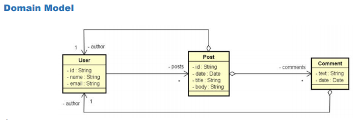
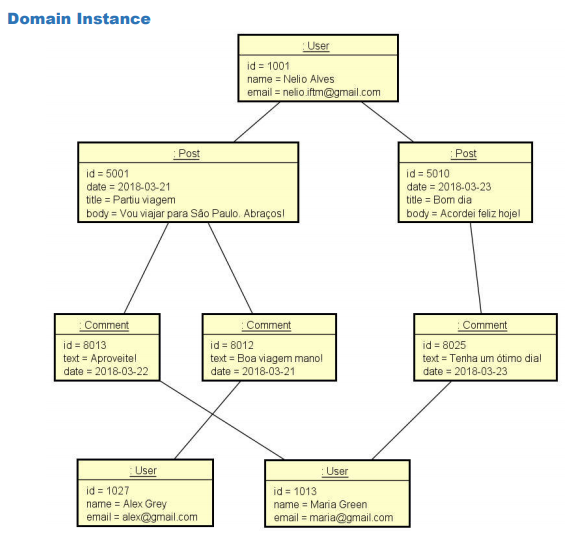
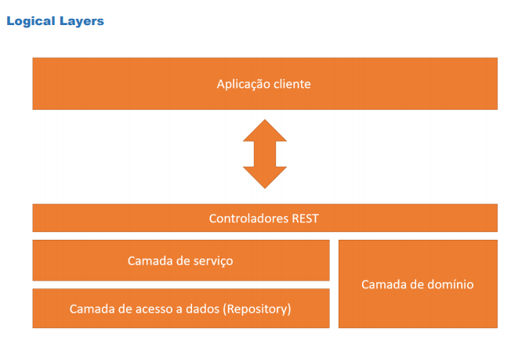

# webservices-springboot2-mongodb
 Projeto Web services Spring Boot com MongoDB com realizado no curso Java COMPLETO da Udemy
 
## Aplicação Web a desenvolver
Projeto web services com Spring Boot e MongoDB

### Ambiente Tecnologico
Spring Tool Suite 4, Java, Maven, Apache Tomcat, Postman, MongoDB, MongoDB Compass

### Objetivos
- Compreender as principais diferenças entre paradigma orientado a documentos e relacional
- Implementar operações de CRUD
- Refletir sobre decisões de design para um banco de dados orientado a documentos
- Implementar associações entre objetos
  - Objetos aninhados
  - Referências
- Realizar consultas com Spring Data e MongoRepository

